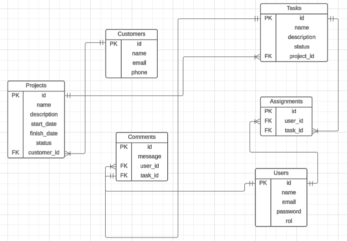

# Project Management | Back End | Express

### Used technologies:

  - [Express](https://expressjs.com/es/)
  - [PostgreSQL](https://www.postgresql.org/)
  - [JavaScript](https://developer.mozilla.org/es/docs/Web/JavaScript)
  - [Happi/boom](https://hapi.dev/module/boom/)
  - [Joi](https://joi.dev/)
  - [Jest](https://jestjs.io/)
  - [Supertest](https://www.npmjs.com/package/supertest)
  - [Fakerjs](https://fakerjs.dev/guide/usage.html)
  - [Sequelize](https://sequelize.org/docs/v6/getting-started/)

### Project description

This project is part of platzi course Backend con Node.js: Base de Datos con PostgreSQL. API Rest with Express.js for project management. 
Entities:
- `Project`
- `Users`
- `Customers`
- `Tasks`
- `Comments`

### BD diagram

